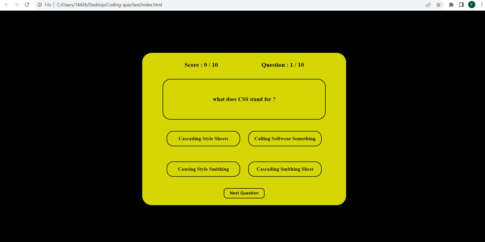

# Coding-quiz

In this wb page I created a coding themed quiz for the user to try out.
I included a number of differnet questions and a tracjer that would track what type of score the user got 
from a great score to a now so great score.

credit: https://www.w3schools.com/css/css_website_layout.asp
        https://stackoverflow.com/
        https://chat.openai.com/
        and of corse alot of GOOGLE.

 

a screenshot of my work 

Instructions:
to begin the quiz simply answer the first question on the page and tap the next question button on the bottom of 
the yellow box, the application will let you know if the answer you registered was the correct answer or not
and will recore the outcome. This procces will continue until the end of the quiz where you will fond out what your
score was and if you passed or not. To play the quiz again simply press the continue button.
